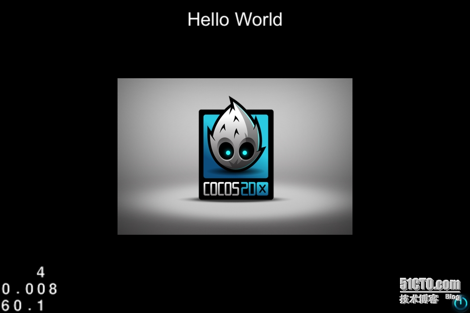

# [【cocos2d-x 从 c++ 到 js】12：回调函数1——按键回调](http://goldlion.blog.51cto.com/4127613/1354756)

回调函数是界面交互和接入各种第三方 SDK 的关键所在，因为回调函数的 C++ 代码是不能自动生成的，一切的一切，都需要手写完成。

比较不错的是，Cocos2d-x 引擎对于回调函数提供了完整的包装机制。我们所需要做的就是了解这个机制，并使用他。学习引擎自己的代码例子，可以比较快速准确的上手这一机制。

首先，我们在 Cocos2d-x 3.0 beta 版中，使用他自带的工程创建工具，新建一个跨平台的 JS 项目。按照惯例，这是一个 helloworld 项目。在 XCode 运行时，我们可以看到：



可以看到右下角的回调按钮。我们来看看他是怎么实现的。分成两个过程来做：


一、绑定回调函数过程  

首先，我们要去找回调函数 JS 的绑定代码，在 myApp.js 中，init 函数里面，可以看到如下代码：

```
// add a "close" icon to exit the progress. it's an autorelease object
var closeItem = cc.MenuItemImage.create(
    "res/CloseNormal.png",
    "res/CloseSelected.png",
    function () {
        cc.log("close button was clicked.");
    },this);
closeItem.setAnchorPoint(cc.p(0.5, 0.5));
var menu = cc.Menu.create(closeItem);
menu.setPosition(cc.p(0, 0));
this.addChild(menu, 1);
closeItem.setPosition(cc.p(size.width - 20, 20));
```

cc.MenuItemImage.create 函数的第三个参数，绑定了匿名回调函数。第四个参数，传入的是回调函数调用时的 this（如果不理解 JS 的 this 机制，请先阅读一些 JS 的资料）。这些都是意图和作用很明显的 JS 代码，不用细说。

然后，我们去看底层对应执行的 C++ 代码。在 cocos2d_specifics.cpp 文件中，找到 js_cocos2dx_CCMenuItemImage_create 函数。

```
// "create" in JS
// cc.MenuItemImage.create( normalImage, selectedImage, [disabledImage], callback_fn, [this]
JSBool js_cocos2dx_CCMenuItemImage_create(JSContext *cx, uint32_t argc, jsval *vp)
{
    if (argc >= 2 && argc <= 5) {
        jsval *argv = JS_ARGV(cx, vp);
        JSStringWrapper arg0(argv[0]);
        JSStringWrapper arg1(argv[1]);
        JSStringWrapper arg2;
        bool thirdArgIsString = true;
        jsval jsCallback = JSVAL_VOID;
        jsval jsThis = JSVAL_VOID;
        int last = 2;
        if (argc >= 3) {
            thirdArgIsString = argv[2].isString();
            if (thirdArgIsString) {
                arg2.set(argv[2], cx);
                last = 3;
            }
        }
        cocos2d::MenuItemImage* ret = cocos2d::MenuItemImage::create(arg0.get(), arg1.get(), std::string(arg2.get()));
        if (argc >= 3) {
            if (!thirdArgIsString) {
                //cc.MenuItemImage.create( normalImage, selectedImage, callback_fn, [this] )
                jsCallback = argv[last++];
                if (argc == 4) {
                    jsThis = argv[last];
                }
            }
            else {
                //cc.MenuItemImage.create( normalImage, selectedImage, disabledImage, callback_fn, [this] )
                if (argc >= 4) {
                    jsCallback = argv[last++];
                    if (argc == 5) {
                        jsThis = argv[last];
                    }
                }
            }
        }
        JSObject *obj = bind_menu_item<cocos2d::MenuItemImage>(cx, ret, jsCallback, jsThis);
        JS_SET_RVAL(cx, vp, OBJECT_TO_JSVAL(obj));
        return JS_TRUE;
    }
    JS_ReportError(cx, "Invalid number of arguments. Expecting: 2 <= args <= 5");
    return JS_FALSE;
}
```

因为在 C++ 层，这是一个重载过的函数，所以他的实现里面有很多参数个数的判断（关于重载问题请参考之前的章节）。过滤掉很多代码，我们直接看关键部分：

```
if (argc >= 3) {
            if (!thirdArgIsString) {
                //cc.MenuItemImage.create( normalImage, selectedImage, callback_fn, [this] )
                jsCallback = argv[last++];
                if (argc == 4) {
                    jsThis = argv[last];
                }
            }
            else {
                //cc.MenuItemImage.create( normalImage, selectedImage, disabledImage, callback_fn, [this] )
                if (argc >= 4) {
                    jsCallback = argv[last++];
                    if (argc == 5) {
                        jsThis = argv[last];
                    }
                }
            }
        }

```
在这里我们从参数中取出回调函数和 this，分别赋值给 jsCallback 和 jsThis。

```
JSObject *obj = bind_menu_item<cocos2d::MenuItemImage>(cx, ret, jsCallback, jsThis);
```

由这句模板函数来实现回调的绑定，四个参数依次是，JS 上下文， cc.MenuItemImage 对应的 C++ 对象，回调函数，和回调函数调用时的 this。

```
template<class T>
JSObject* bind_menu_item(JSContext *cx, T* nativeObj, jsval callback, jsval thisObj) {  
    js_proxy_t *p = jsb_get_native_proxy(nativeObj);
    if (p) {
        addCallBackAndThis(p->obj, callback, thisObj);
        return p->obj;
    } else {
        js_type_class_t *classType = js_get_type_from_native<T>(nativeObj);
        assert(classType);
        JSObject *tmp = JS_NewObject(cx, classType->jsclass, classType->proto, classType->parentProto);
        // bind nativeObj <-> JSObject
        js_proxy_t *proxy = jsb_new_proxy(nativeObj, tmp);
        JS_AddNamedObjectRoot(cx, &proxy->obj, typeid(*nativeObj).name());      
        addCallBackAndThis(tmp, callback, thisObj);
        return tmp;
    }
}

```
继续看 bind_menu_item 的实现。简单说一下，因为绑定的是一个 JS 函数，所以实际上，需要在 SpiderMonkey 里面做这个绑定操作。传进来的是一个 C++ 对象（CCMenuItemImage 类型），首先找到和这个 C++ 对象对应的 JS 对象。如果找不到，就新建立一个。然后通过函数 addCallBackAndThis 执行绑定。

```
static void addCallBackAndThis(JSObject *obj, jsval callback, jsval &thisObj)
{
    if(callback != JSVAL_VOID) {
        ScriptingCore::getInstance()->setReservedSpot(0, obj, callback);
    }
    if(thisObj != JSVAL_VOID) {
        ScriptingCore::getInstance()->setReservedSpot(1, obj, thisObj);
    }
}
```

```
JSBool ScriptingCore::setReservedSpot(uint32_t i, JSObject *obj, jsval value) {
    JS_SetReservedSlot(obj, i, value);
    return JS_TRUE;
}
```

最终我们看到，存储回调函数的方法是通过 SpiderMonkey 的  ReservedSlot 机制。0位存放的是回调函数，1位存放的是回调函数对应的 this。

好，到此为止，回调函数的绑定全部结束。

二、调用回调函数过程

现在我们看从 C++ 层启动JS回调的过程。我们省略掉事件派发机制，直接看按键事件发生时的调用代码。在按键事件发生时，会调用 MenuItemImage 的父类 MenuItem 中的 activate 函数。该函数在 CCMenuItem.cpp 中。

```
void MenuItem::activate()
{
    if (_enabled)
    {
        if( _callback )
        {
            _callback(this);
        }
                                                                                                                            
        if (kScriptTypeNone != _scriptType)
        {
            BasicScriptData data(this);
            ScriptEvent scriptEvent(kMenuClickedEvent,&data);
            ScriptEngineManager::getInstance()->getScriptEngine()->sendEvent(&scriptEvent);
        }
    }
}
```

非常简单，首先判断按键是否可用。然后如果有 C++ 层回调就调用。如果有脚本层（JS 或 lua）回调，就包装一个 kMenuClickedEvent 事件，然后向对应的脚本引擎发送该事件。

```
int ScriptingCore::sendEvent(ScriptEvent* evt)
{
    if (NULL == evt)
        return 0;
                                                                 
    JSAutoCompartment ac(_cx, _global);
                                                                    
    switch (evt->type)
    {
        case kNodeEvent:
            {
                return handleNodeEvent(evt->data);
            }
            break;
        case kMenuClickedEvent:
            {
                return handleMenuClickedEvent(evt->data);
            }
            break;
        case kTouchEvent:
            {
                return handleTouchEvent(evt->data);
            }
            break;
        case kTouchesEvent:
            {
                return handleTouchesEvent(evt->data);
            }
            break;
        case kKeypadEvent:
            {
                return handleKeypadEvent(evt->data);
            }
            break;
        case kAccelerometerEvent:
            {
                return handleAccelerometerEvent(evt->data);
            }
            break;
        default:
            break;
    }
                                                                    
    return 0;
}
```

JS 通过 ScriptingCore::sendEvent 进行事件分发。  kMenuClickedEvent 事件派发给 handleMenuClickedEvent 函数来处理。

```
int ScriptingCore::handleMenuClickedEvent(void* data)
{
    if (NULL == data)
        return 0;
                                                           
    BasicScriptData* basicScriptData = static_cast<BasicScriptData*>(data);
    if (NULL == basicScriptData->nativeObject)
        return 0;
                                                           
    MenuItem* menuItem = static_cast<MenuItem*>(basicScriptData->nativeObject);
                                                           
    js_proxy_t * p = jsb_get_native_proxy(menuItem);
    if (!p) return 0;
    jsval retval;
    jsval dataVal;
    js_proxy_t *proxy = jsb_get_native_proxy(menuItem);
    dataVal = (proxy ? OBJECT_TO_JSVAL(proxy->obj) : JSVAL_NULL);
    executeJSFunctionFromReservedSpot(this->_cx, p->obj, dataVal, retval);
    return 1;
}
```

```
static void executeJSFunctionFromReservedSpot(JSContext *cx, JSObject *obj,
                                              jsval &dataVal, jsval &retval) {
    jsval func = JS_GetReservedSlot(obj, 0);
    if (func == JSVAL_VOID) { return; }
    jsval thisObj = JS_GetReservedSlot(obj, 1);
    JSAutoCompartment ac(cx, obj);
                       
    if (thisObj == JSVAL_VOID) {
        JS_CallFunctionValue(cx, obj, func, 1, &dataVal, &retval);
    } else {
        assert(!JSVAL_IS_PRIMITIVE(thisObj));
        JS_CallFunctionValue(cx, JSVAL_TO_OBJECT(thisObj), func, 1, &dataVal, &retval);
    }
}
```

再次通过 SpiderMonkey 的 ReservedSlot 机制，取回相应的参数，最后通过 JS_CallFunctionValue 函数完成 JS 层回调函数的调用。

下篇继续
