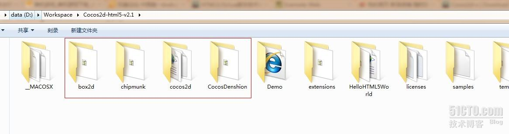

# [【cocos2d-x 从 c++ 到 js】01：迎接脚本时代的到来](http://goldlion.blog.51cto.com/4127613/1113786)

随着移动领域进入的游戏公司越来越多，开发成本一路上涨。以 C++ 为代表的老一代开发语言，将直面 lua，js 等脚本语言的冲击。
最近一年多来，移动端在做脚本化开发方案的公司越来越多。cocos2d 开源社区很早就提出了用 js 打通各个分支版本的设想，底层执行方式是各个分支引擎的（-x，-iphone，html5），上层统一使用 js，使得项目可以很方便的在各个引擎之间互换。
从游戏开发来看，c++ 和 js 各具优势，两者结合威力无穷。前不久，cocos2d 社区进行了一次联合发布，迈出了关键的一步。本系列将是我学习cocos2d-x for js 的一些心得体会。
cocos2d-x for js 是 cocos2d-x 的一部分，他使用 js 做脚本，底层使用 c++ 运行，在提升开发速度同时，保证了执行效率。

首先，我们下载cocos2d-x的最新版本  

<http://cocos2d-x.googlecode.com/files/cocos2d-2.1beta3-x-2.1.0.zip>

该版本中有好几个 js 游戏的例子：CocosDragonJS，MoonWarriors，WatermelonWithMe  
我们暂时不使用其他 IDE 了，对于 cocos2d-x 的开发者来说，手头最现成的工具就是vs。用 vs2010 打开工程，蛋疼的发现，里面既没有 js 代码，也没有 c++ 代码。只有一个 spidermonkey 的 js 解释器，还有一个 win32 版 cocos2d-x 的壳。

好吧，首先我们需要导入 js 的源代码，很不幸，这个项目的js源码也没有放在 MoonWarriors 的目录下，而是在 
cocos2d-2.1beta3-x-2.1.0\samples\TestJavascript\cocos2d-js-tests\games\MoonWarriors 这个文件夹中
我们把这里面的代码导入到 MoonWarriors 项目中。

好吧，这个目录结构比较蛋疼。但是勉强能看了。
但是又遇到了另外一个问题，我们在 js 源代码中，没法.出来代码，自动完成功能几乎是无效的。番茄只能提示出当前 js 文件中的代码，在其他文件中的代码，没法提示出来。尤其是引擎中的 js 接口。这个实在太要命了。
我查了半天，发现 cocos2d-2.1beta3-x-2.1.0 引擎中，根本没有 js 版本的代码。也就是说，他们只是用 spidermonke y把 js 的接口绑定成了 c++ 的。这可如何是好呢？没代码就没法使用自动完成。

呵呵，之前我们说过，这次是一次联合发布，也就是说各个版本的 js 接口应该是一致的，也就是说我们可以使用 html5 版本的js代码，来协助完成代码提示。
去下一 个html5 引擎
<http://cocos2d-x.googlecode.com/files/Cocos2d-html5-v2.1.zip>
打开后发现，我们要的代码在这四个文件夹里

把他们也导入到项目中

然后，我们随便打开一个项目源代码，就可以.出来了。自动完成可以使用，哦也。

打完收工。