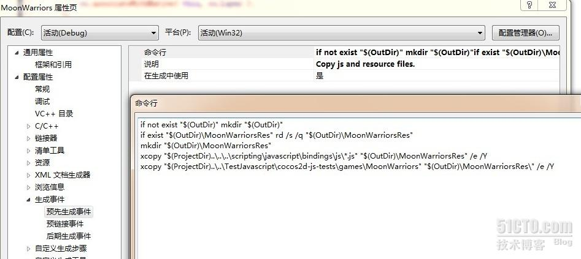
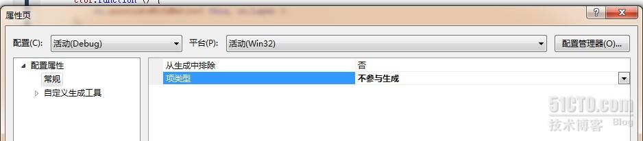
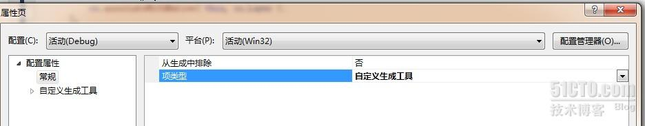
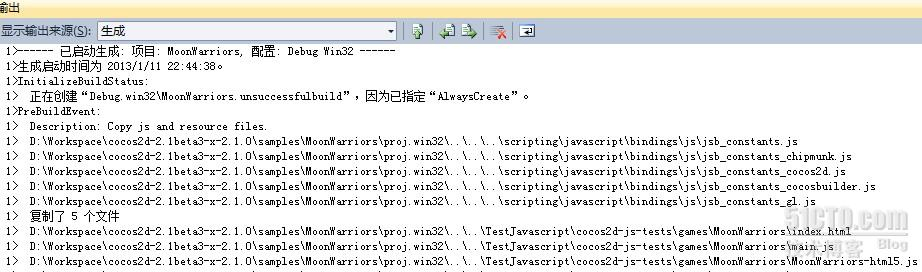

# [【cocos2d-x 从 c++到 js】02：解决在 vs 中修改 js 源文件无效](http://goldlion.blog.51cto.com/4127613/1114959)

之前我们讲到了，如何去把 cocos2d-x 引擎自带的 MoonWarriors 例子工程导入源码，然后可以方便学习和编辑。
但是我事后发现，如果修改了 js 代码后，点击调试，运行时仍然是之前的结果，毫无变化。这是怎么回事呢？
仔细观察后，我发现，对于 cocos2d-x for js 来说，js 脚本只是一个资源文件，他在生成工程时，会执行一个批处理，这个批处理的作用就是拷贝资源文件到对应的目录下。

可以看到，只有在生成项目时才会执行这个批处理，也就是说，在项目代码被修改之后。但正如你之前看到的，这是一个 c++ 项目，js 脚本只是作为资源。
那么真的没有办法了吗？其实很简单，vs2010 有一个生成工具选择的功能，对于不同的文件类型使用不同的工具去处理。
我们首先右键选择所有项目中的 js 源码文件，点击属性，可以看到如下

项类型为“不参与生成”，这个就是问题的所在，因为不参与，所以 vs 不会监视这个文件的变化。我们把它改成“自定义生成工具”

然后，我们随便改一下 js 的源码，然后直接点绿三角运行项目。可以看到，项目重新生成，并且 vs 自动复制 js 文件了

打完收工